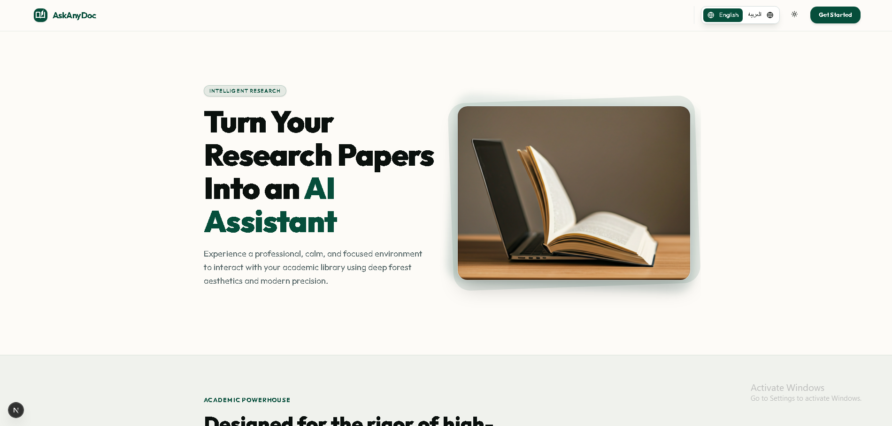
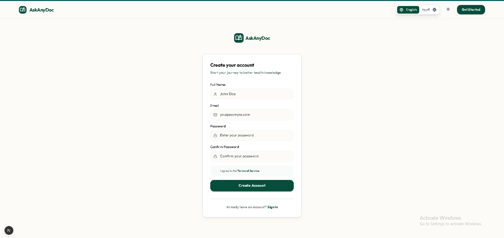
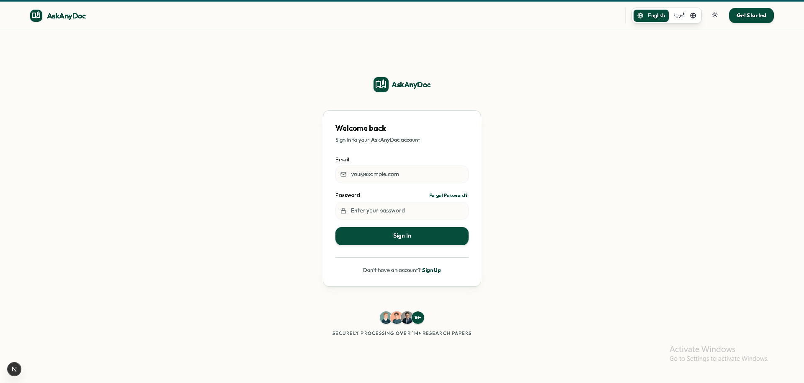
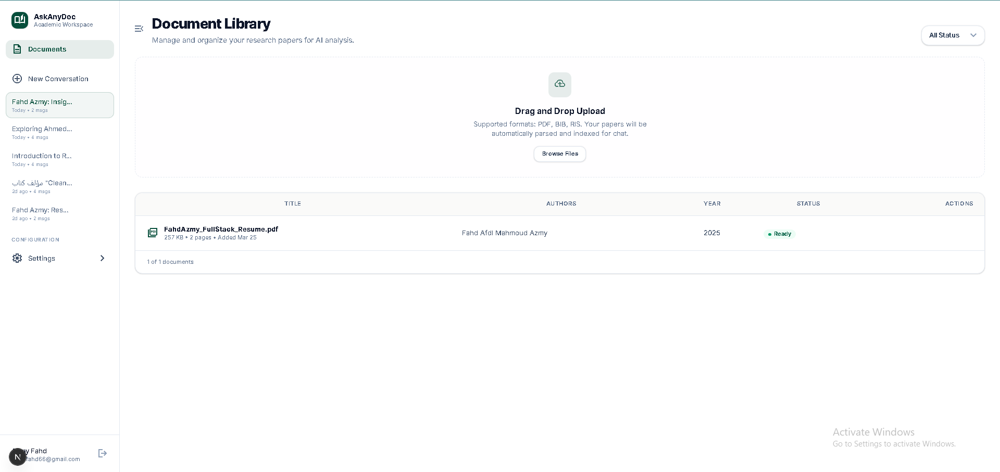
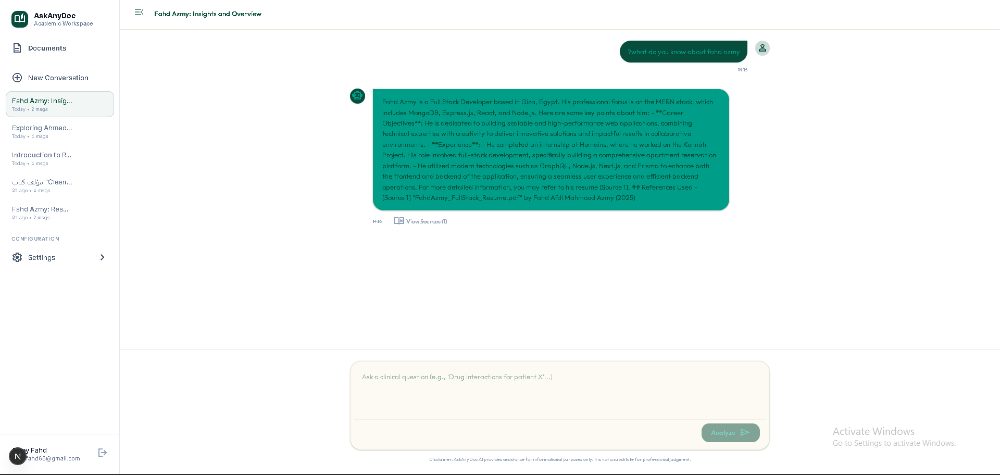

# AskAnyDoc 

🎥 **[Watch Project Video / Demo](https://drive.google.com/file/d/1orYzEReiFCX4dnPMEahfZVs3BgNinJ5F/view?usp=sharing)**

**AskAnyDoc** is an intelligent, full-stack Academic Research Assistant and Retrieval-Augmented Generation (RAG) platform. It allows users to upload PDF research papers and intuitively chat with them—receiving precise answers backed by exact source attribution and publication-ready citations (APA, MLA, BibTeX).

---

## 📸 Application Preview

### 1. Landing Page
The landing page introduces **AskAnyDoc** with a clean, professional aesthetic. It clearly highlights the core value proposition: turning research papers into an interactive AI assistant, and offers an easy starting point for users through the "Get Started" call-to-action.


### 2. Sign Up (Create Account)
A streamlined and secure registration page where new users can create an account. This page ensures that everyone's workspace and uploaded documents remain strictly isolated using JWT-based authentication.


### 3. Sign In (Welcome Back)
A minimalist login interface welcoming returning users to their accounts. It provides standard fields for email and password authentication, complete with helpful links like "Forgot Password?".


### 4. Document Library
The core document management dashboard. Here, users can easily drag-and-drop research papers (PDFs) to be uploaded, parsed, and embedded asynchronously. It lists uploaded documents with key metadata such as Title, Authors, Year, and processing Status (e.g., *Ready*).


### 5. Document Chat Interface
An intuitive messaging interface dedicated to a specific document or conversation. Users can interact strictly with the contextual knowledge of their uploaded files. The AI provides coherent responses alongside direct citations and source references from the underlying research materials.


---

## 🛠 Features

- **Semantic Document Chat:** Highly accurate answers generated exclusively from uploaded PDFs.
- **Asynchronous Ingestion:** Background workers (Celery) seamlessly extract, chunk, and embed large documents without blocking the main API.
- **Real-time Streaming:** Smooth, SSE-powered streaming of AI responses.
- **Secure Isolation:** JWT-based user authentication keeps everyone's workspace strictly isolated.
- **Bilingual UI:** Native support for English and Arabic.

---

## 🚀 Tech Stack

- **Frontend:** Next.js 16 (App Router), React 19, TailwindCSS, Redux Toolkit
- **Backend:** FastAPI, Python 3.10+, SQLAlchemy (Async), Alembic
- **Database:** PostgreSQL 16 (w/ pgvector plugin for storing embeddings)
- **Task Queue:** Celery with Redis broker
- **AI/LLM:** OpenAI (`gpt-4o-mini`, `text-embedding-3-small`)
- **Infrastructure:** Docker, Docker Compose

---

## ⚙️ How to Run Locally

### Prerequisites
- [Docker](https://www.docker.com/) and Docker Compose
- [Python 3.10+](https://www.python.org/downloads/)
- [Node.js 18+](https://nodejs.org/)

### 1. Database & Infrastructure Setup
Start the PostgreSQL (pgvector) database and Redis broker using Docker.

```bash
cd backend/docker

# Copy example env files if necessary, then start infrastructure
docker-compose up -d
```
*(Wait a few seconds for the database and Redis to fully initialize.)*

### 2. Backend Setup
Open a **new terminal** for the FastAPI backend.

```bash
cd backend

# Create and activate a virtual environment
python -m venv venv
# On Windows:
venv\Scripts\activate
# On macOS/Linux:
# source venv/bin/activate

# Install dependencies
pip install -r requirements.txt

# Configure Environment Variables
# Create a `.env` file based on `.env.example` in the backend root directory.
# Ensure you provide your OPENAI_API_KEY and the correct PostgreSQL URL.

# Run database migrations
alembic upgrade head

# Start the FastAPI server
uvicorn src.main:app --reload
```
The API will be available at: http://localhost:8000

### 3. Background Worker Setup (Celery)
Open a **new terminal** to run the Celery worker for processing PDF uploads asynchronously.

```bash
cd backend

# Activate your virtual environment
# On Windows:
venv\Scripts\activate
# On macOS/Linux:
# source venv/bin/activate

# Start the Celery worker
# On Windows (use the eventlet pool or solo pool to avoid multiprocessing issues):
pip install eventlet
celery -A src.tasks worker -l info -P eventlet

# On macOS/Linux:
# celery -A src.tasks worker -l info
```

### 4. Frontend Setup
Open a **new terminal** for the Next.js frontend application.

```bash
cd frontend

# Install dependencies
npm install

# Configure Environment Variables
# Ensure `.env.local` contains the correct `NEXT_PUBLIC_API_URL` (usually http://localhost:8000)

# Start the development server
npm run dev
```
The frontend application will be available at: http://localhost:3000

---

## 🧪 Running Tests
The project includes automated tests using `pytest` (backed by an asynchronous test database).

```bash
cd backend
venv\Scripts\activate

# Run the test suite
pytest -v
```

---

## 📄 License
All rights reserved. AskAnyDoc is proprietary software.
